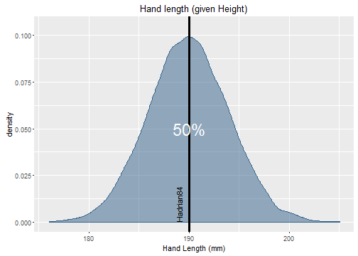

## Introduction

This application asks for four inputs:

- Your name
- Gender
- Height
- Hand length 

It also relies on a dataset containing many body statistics. This dataset is publicly available (ANSUR: [click here](http://mreed.umtri.umich.edu/mreed/downloads.html#ansur)).

For the purpose of this tour, we used randomized data.

---

## First graphs generated

Based on your input, it compares your **height** and **hand length** with a representative population. 

It also shows what percentage of people have higher values than you.

--- 

## Summarizing graph

This regression plot shows the overall **height** and **hand length** relationship (dotted blue line). As expected, taller people have bigger hands (and vice versa). 

Where you reside in this plot is indicated by the red dot.

--- 

## Concluding graph

The final graph uses a segment of the regression plot and displays your **hand length** in the hand length distribution of people with your height. 

Again, it shows what percentage of people (with your height) have bigger hands than you.
